# StockFlow — Architecture & Data Flow

## Colour Key

| Colour | Meaning |
|--------|---------|
| Green | Working — data flows end-to-end |
| Red / Orange | Stubbed — returns 501 or placeholder |
| Blue | External service (Supabase, Google) |
| Purple | AI service (Gemini) |
| Grey | Static / config |

---

## Part 1: Current State (Before Exercises)

### 1.1 High-Level System Overview

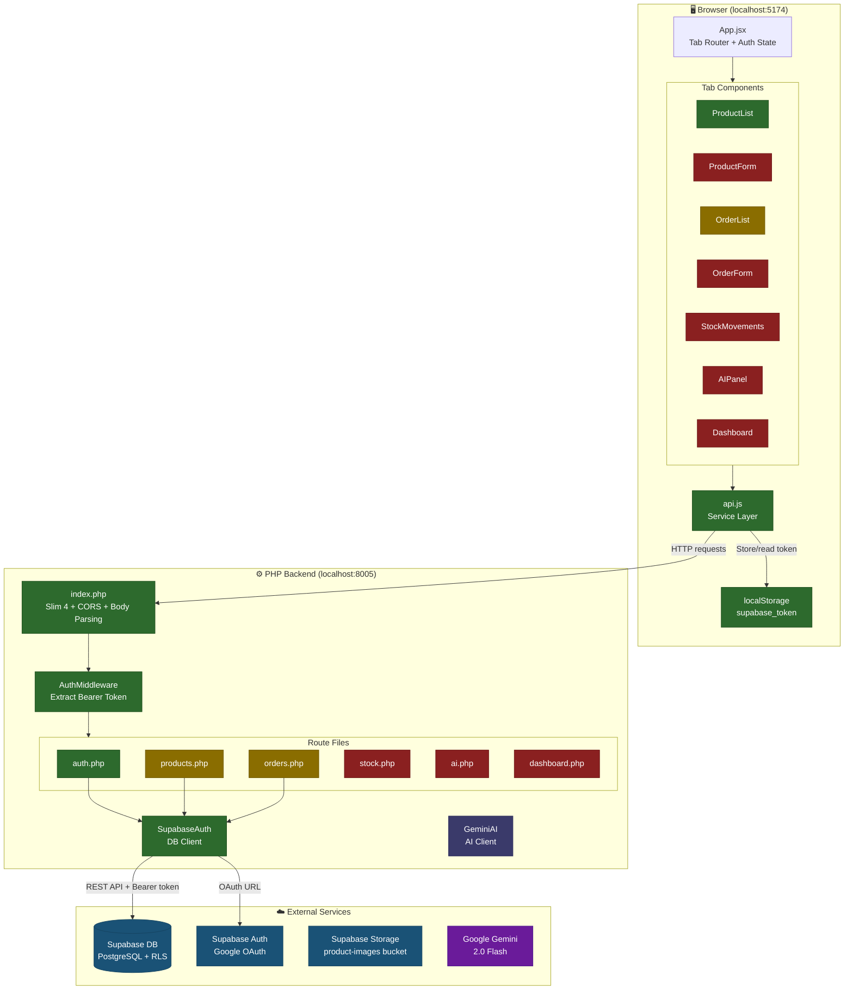
```mermaid
graph TB
    subgraph Browser["🖥️ Browser (localhost:5174)"]
        direction TB
        App["App.jsx<br/>Tab Router + Auth State"]

        subgraph Tabs["Tab Components"]
            PL["ProductList"]:::working
            PF["ProductForm"]:::broken
            OL["OrderList"]:::partial
            OF["OrderForm"]:::broken
            SM["StockMovements"]:::broken
            AI["AIPanel"]:::broken
            DB["Dashboard"]:::broken
        end

        API["api.js<br/>Service Layer"]:::working
        LS["localStorage<br/>supabase_token"]:::working
    end

    subgraph PHP["⚙️ PHP Backend (localhost:8005)"]
        direction TB
        IX["index.php<br/>Slim 4 + CORS + Body Parsing"]:::working
        AM["AuthMiddleware<br/>Extract Bearer Token"]:::working

        subgraph Routes["Route Files"]
            AR["auth.php"]:::working
            PR["products.php"]:::partial
            OR["orders.php"]:::partial
            SR["stock.php"]:::broken
            AIR["ai.php"]:::broken
            DR["dashboard.php"]:::broken
        end

        SA["SupabaseAuth<br/>DB Client"]:::working
        GAI["GeminiAI<br/>AI Client"]:::ready
    end

    subgraph External["☁️ External Services"]
        SDB[("Supabase DB<br/>PostgreSQL + RLS")]:::external
        SAUTH["Supabase Auth<br/>Google OAuth"]:::external
        SSTORE["Supabase Storage<br/>product-images bucket"]:::external
        GEM["Google Gemini<br/>2.0 Flash"]:::ai
    end

    App --> Tabs
    Tabs --> API
    API -->|"HTTP requests"| IX
    IX --> AM
    AM --> Routes
    AR --> SA
    PR --> SA
    OR --> SA
    SA -->|"REST API + Bearer token"| SDB
    SA -->|"OAuth URL"| SAUTH
    API -->|"Store/read token"| LS

    classDef working fill:#2d6a2d,stroke:#1a4a1a,color:#fff
    classDef partial fill:#8a6d00,stroke:#6b5500,color:#fff
    classDef broken fill:#8a2020,stroke:#6b1515,color:#fff
    classDef ready fill:#3a3a6a,stroke:#2a2a5a,color:#fff
    classDef external fill:#1a5276,stroke:#154360,color:#fff
    classDef ai fill:#6a1b9a,stroke:#4a148c,color:#fff
```

### 1.2 Authentication Flow (Working)

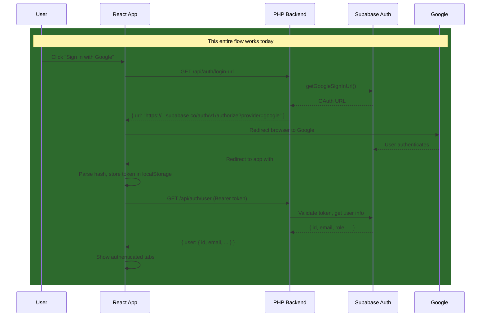
```mermaid
sequenceDiagram
    participant U as User
    participant R as React App
    participant P as PHP Backend
    participant S as Supabase Auth
    participant G as Google

    rect rgb(45, 106, 45)
        Note over U,G: This entire flow works today

        U->>R: Click "Sign in with Google"
        R->>P: GET /api/auth/login-url
        P->>S: getGoogleSignInUrl()
        S-->>P: OAuth URL
        P-->>R: { url: "https://...supabase.co/auth/v1/authorize?provider=google" }
        R->>G: Redirect browser to Google
        G-->>S: User authenticates
        S-->>R: Redirect to app with #access_token=eyJ...
        R->>R: Parse hash, store token in localStorage
        R->>P: GET /api/auth/user (Bearer token)
        P->>S: Validate token, get user info
        S-->>P: { id, email, role, ... }
        P-->>R: { user: { id, email, ... } }
        R->>R: Show authenticated tabs
    end
```

### 1.3 Product List Flow (Partially Working)

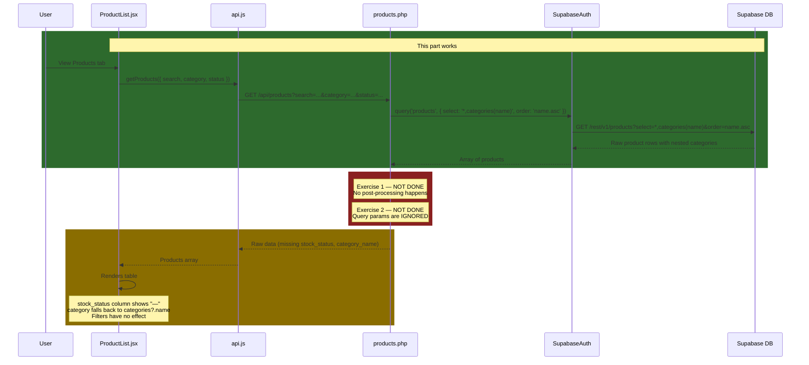
```mermaid
sequenceDiagram
    participant U as User
    participant PL as ProductList.jsx
    participant API as api.js
    participant PR as products.php
    participant SA as SupabaseAuth
    participant DB as Supabase DB

    rect rgb(45, 106, 45)
        Note over PL,DB: This part works
        U->>PL: View Products tab
        PL->>API: getProducts({ search, category, status })
        API->>PR: GET /api/products?search=...&category=...&status=...
        PR->>SA: query('products', { select: '*,categories(name)', order: 'name.asc' })
        SA->>DB: GET /rest/v1/products?select=*,categories(name)&order=name.asc
        DB-->>SA: Raw product rows with nested categories
        SA-->>PR: Array of products
    end

    rect rgb(138, 32, 32)
        Note over PR,PR: Exercise 1 — NOT DONE<br/>No post-processing happens
        Note over PR,PR: Exercise 2 — NOT DONE<br/>Query params are IGNORED
    end

    rect rgb(138, 109, 0)
        PR-->>API: Raw data (missing stock_status, category_name)
        API-->>PL: Products array
        PL->>PL: Renders table
        Note over PL,PL: stock_status column shows "—"<br/>category falls back to categories?.name<br/>Filters have no effect
    end
```

### 1.4 Orders Flow (Partially Working)

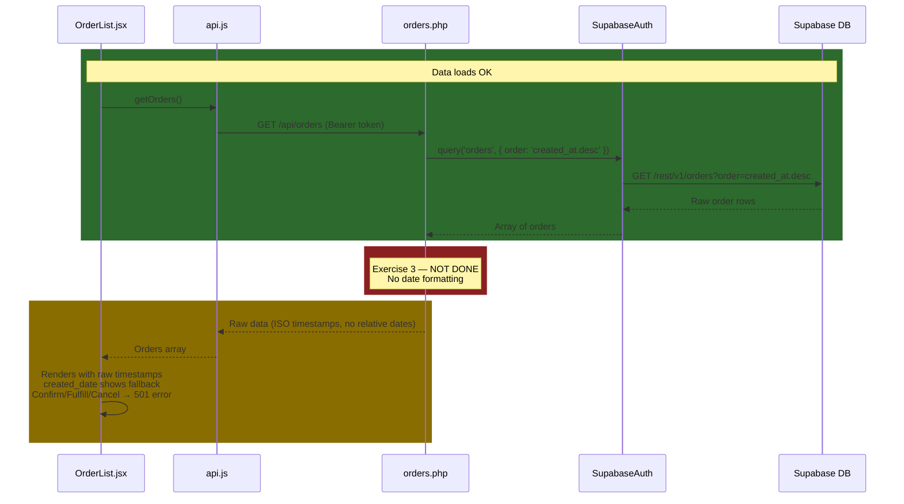
```mermaid
sequenceDiagram
    participant OL as OrderList.jsx
    participant API as api.js
    participant OR as orders.php
    participant SA as SupabaseAuth
    participant DB as Supabase DB

    rect rgb(45, 106, 45)
        Note over OL,DB: Data loads OK
        OL->>API: getOrders()
        API->>OR: GET /api/orders (Bearer token)
        OR->>SA: query('orders', { order: 'created_at.desc' })
        SA->>DB: GET /rest/v1/orders?order=created_at.desc
        DB-->>SA: Raw order rows
        SA-->>OR: Array of orders
    end

    rect rgb(138, 32, 32)
        Note over OR,OR: Exercise 3 — NOT DONE<br/>No date formatting
    end

    rect rgb(138, 109, 0)
        OR-->>API: Raw data (ISO timestamps, no relative dates)
        API-->>OL: Orders array
        OL->>OL: Renders with raw timestamps<br/>created_date shows fallback<br/>Confirm/Fulfill/Cancel → 501 error
    end
```

### 1.5 Current Route Status Map

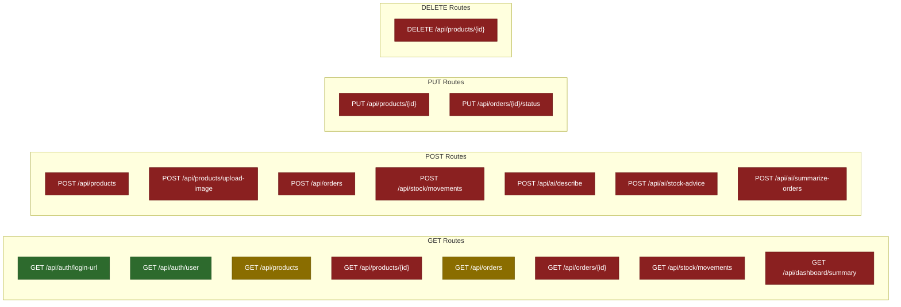
```mermaid
graph LR
    subgraph "GET Routes"
        G1["GET /api/auth/login-url"]:::working
        G2["GET /api/auth/user"]:::working
        G3["GET /api/products"]:::partial
        G4["GET /api/products/{id}"]:::broken
        G5["GET /api/orders"]:::partial
        G6["GET /api/orders/{id}"]:::broken
        G7["GET /api/stock/movements"]:::broken
        G8["GET /api/dashboard/summary"]:::broken
    end

    subgraph "POST Routes"
        P1["POST /api/products"]:::broken
        P2["POST /api/products/upload-image"]:::broken
        P3["POST /api/orders"]:::broken
        P4["POST /api/stock/movements"]:::broken
        P5["POST /api/ai/describe"]:::broken
        P6["POST /api/ai/stock-advice"]:::broken
        P7["POST /api/ai/summarize-orders"]:::broken
    end

    subgraph "PUT Routes"
        U1["PUT /api/products/{id}"]:::broken
        U2["PUT /api/orders/{id}/status"]:::broken
    end

    subgraph "DELETE Routes"
        D1["DELETE /api/products/{id}"]:::broken
    end

    classDef working fill:#2d6a2d,stroke:#1a4a1a,color:#fff
    classDef partial fill:#8a6d00,stroke:#6b5500,color:#fff
    classDef broken fill:#8a2020,stroke:#6b1515,color:#fff
```

### 1.6 What Each Component Sees Today

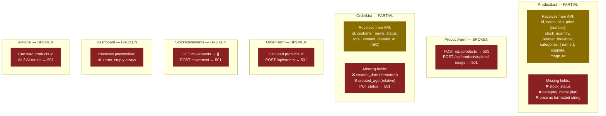
```mermaid
graph TD
    subgraph "ProductList — PARTIAL"
        PL_IN["Receives from API:<br/>id, name, sku, price (number),<br/>stock_quantity, reorder_threshold,<br/>categories: { name }, supplier,<br/>image_url"]:::partial
        PL_MISS["Missing fields:<br/>❌ stock_status<br/>❌ category_name (flat)<br/>❌ price as formatted string"]:::broken
    end

    subgraph "ProductForm — BROKEN"
        PF_IN["POST /api/products → 501<br/>POST /api/products/upload-image → 501"]:::broken
    end

    subgraph "OrderList — PARTIAL"
        OL_IN["Receives from API:<br/>id, customer_name, status,<br/>total_amount, created_at (ISO)"]:::partial
        OL_MISS["Missing fields:<br/>❌ created_date (formatted)<br/>❌ created_ago (relative)<br/>PUT status → 501"]:::broken
    end

    subgraph "OrderForm — BROKEN"
        OF_IN["Can load products ✅<br/>POST /api/orders → 501"]:::broken
    end

    subgraph "StockMovements — BROKEN"
        SM_IN["GET movements → []<br/>POST movement → 501"]:::broken
    end

    subgraph "Dashboard — BROKEN"
        DB_IN["Receives placeholder:<br/>all zeros, empty arrays"]:::broken
    end

    subgraph "AIPanel — BROKEN"
        AI_IN["Can load products ✅<br/>All 3 AI routes → 501"]:::broken
    end

    classDef working fill:#2d6a2d,stroke:#1a4a1a,color:#fff
    classDef partial fill:#8a6d00,stroke:#6b5500,color:#fff
    classDef broken fill:#8a2020,stroke:#6b1515,color:#fff
```

---

## Part 2: After All Exercises Complete

### 2.1 Complete System Overview

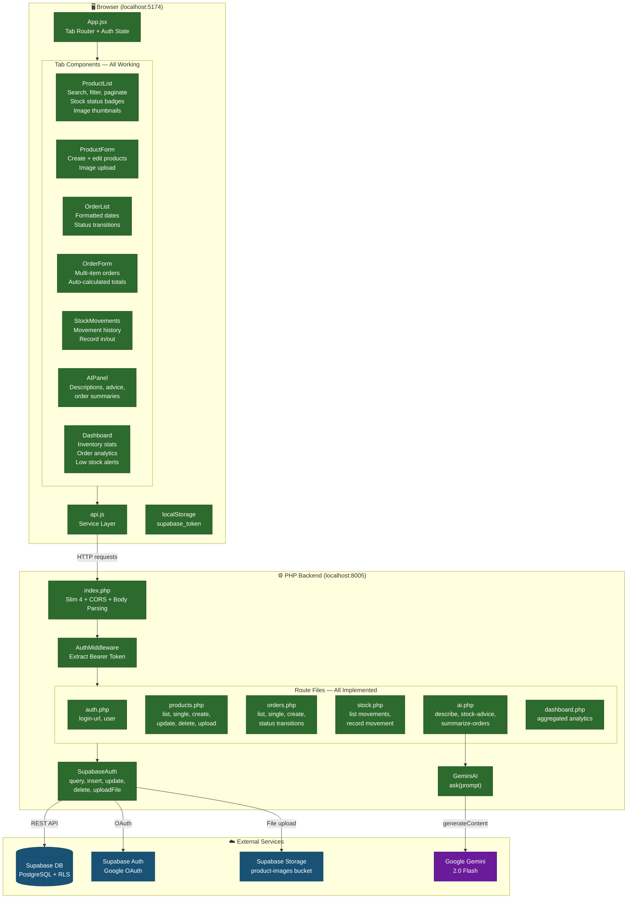
```mermaid
graph TB
    subgraph Browser["🖥️ Browser (localhost:5174)"]
        direction TB
        App["App.jsx<br/>Tab Router + Auth State"]:::working

        subgraph Tabs["Tab Components — All Working"]
            PL["ProductList<br/>Search, filter, paginate<br/>Stock status badges<br/>Image thumbnails"]:::working
            PF["ProductForm<br/>Create + edit products<br/>Image upload"]:::working
            OL["OrderList<br/>Formatted dates<br/>Status transitions"]:::working
            OF["OrderForm<br/>Multi-item orders<br/>Auto-calculated totals"]:::working
            SM["StockMovements<br/>Movement history<br/>Record in/out"]:::working
            AI["AIPanel<br/>Descriptions, advice,<br/>order summaries"]:::working
            DB["Dashboard<br/>Inventory stats<br/>Order analytics<br/>Low stock alerts"]:::working
        end

        API["api.js<br/>Service Layer"]:::working
        LS["localStorage<br/>supabase_token"]:::working
    end

    subgraph PHP["⚙️ PHP Backend (localhost:8005)"]
        direction TB
        IX["index.php<br/>Slim 4 + CORS + Body Parsing"]:::working
        AM["AuthMiddleware<br/>Extract Bearer Token"]:::working

        subgraph Routes["Route Files — All Implemented"]
            AR["auth.php<br/>login-url, user"]:::working
            PR["products.php<br/>list, single, create,<br/>update, delete, upload"]:::working
            OR["orders.php<br/>list, single, create,<br/>status transitions"]:::working
            SR["stock.php<br/>list movements,<br/>record movement"]:::working
            AIR["ai.php<br/>describe, stock-advice,<br/>summarize-orders"]:::working
            DR["dashboard.php<br/>aggregated analytics"]:::working
        end

        SA["SupabaseAuth<br/>query, insert, update,<br/>delete, uploadFile"]:::working
        GAI["GeminiAI<br/>ask(prompt)"]:::working
    end

    subgraph External["☁️ External Services"]
        SDB[("Supabase DB<br/>PostgreSQL + RLS")]:::external
        SAUTH["Supabase Auth<br/>Google OAuth"]:::external
        SSTORE["Supabase Storage<br/>product-images bucket"]:::external
        GEM["Google Gemini<br/>2.0 Flash"]:::ai
    end

    App --> Tabs
    Tabs --> API
    API -->|"HTTP requests"| IX
    IX --> AM
    AM --> Routes
    Routes --> SA
    SA -->|"REST API"| SDB
    SA -->|"OAuth"| SAUTH
    SA -->|"File upload"| SSTORE
    AIR --> GAI
    GAI -->|"generateContent"| GEM

    classDef working fill:#2d6a2d,stroke:#1a4a1a,color:#fff
    classDef external fill:#1a5276,stroke:#154360,color:#fff
    classDef ai fill:#6a1b9a,stroke:#4a148c,color:#fff
```

### 2.2 Complete Route Status Map

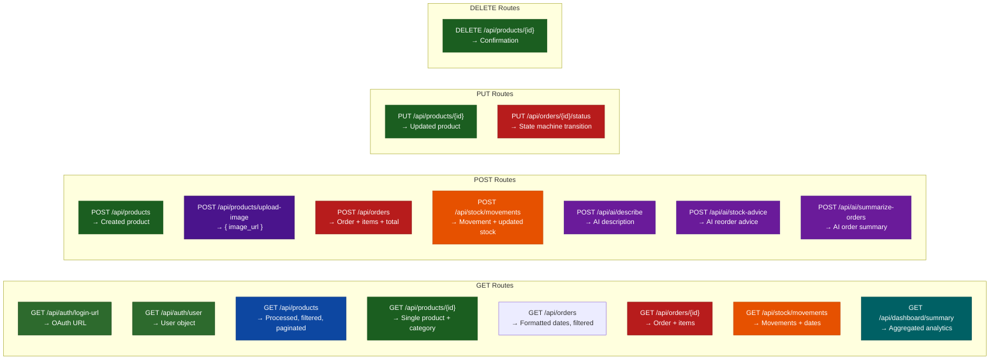
```mermaid
graph LR
    subgraph "GET Routes"
        G1["GET /api/auth/login-url<br/>→ OAuth URL"]:::working
        G2["GET /api/auth/user<br/>→ User object"]:::working
        G3["GET /api/products<br/>→ Processed, filtered, paginated"]:::ex12
        G4["GET /api/products/{id}<br/>→ Single product + category"]:::ex4
        G5["GET /api/orders<br/>→ Formatted dates, filtered"]:::ex36
        G6["GET /api/orders/{id}<br/>→ Order + items"]:::ex6
        G7["GET /api/stock/movements<br/>→ Movements + dates"]:::ex3
        G8["GET /api/dashboard/summary<br/>→ Aggregated analytics"]:::ex7
    end

    subgraph "POST Routes"
        P1["POST /api/products<br/>→ Created product"]:::ex4
        P2["POST /api/products/upload-image<br/>→ { image_url }"]:::ex5
        P3["POST /api/orders<br/>→ Order + items + total"]:::ex6
        P4["POST /api/stock/movements<br/>→ Movement + updated stock"]:::ex3
        P5["POST /api/ai/describe<br/>→ AI description"]:::ex8
        P6["POST /api/ai/stock-advice<br/>→ AI reorder advice"]:::ex8
        P7["POST /api/ai/summarize-orders<br/>→ AI order summary"]:::ex8
    end

    subgraph "PUT Routes"
        U1["PUT /api/products/{id}<br/>→ Updated product"]:::ex4
        U2["PUT /api/orders/{id}/status<br/>→ State machine transition"]:::ex6
    end

    subgraph "DELETE Routes"
        D1["DELETE /api/products/{id}<br/>→ Confirmation"]:::ex4
    end

    classDef working fill:#2d6a2d,stroke:#1a4a1a,color:#fff
    classDef ex12 fill:#0d47a1,stroke:#0a3680,color:#fff
    classDef ex3 fill:#e65100,stroke:#bf4400,color:#fff
    classDef ex4 fill:#1b5e20,stroke:#145218,color:#fff
    classDef ex5 fill:#4a148c,stroke:#380f6a,color:#fff
    classDef ex6 fill:#b71c1c,stroke:#8e1616,color:#fff
    classDef ex7 fill:#006064,stroke:#004d50,color:#fff
    classDef ex8 fill:#6a1b9a,stroke:#4a148c,color:#fff
```

### 2.3 Exercise 1 & 2 — Product Data Processing

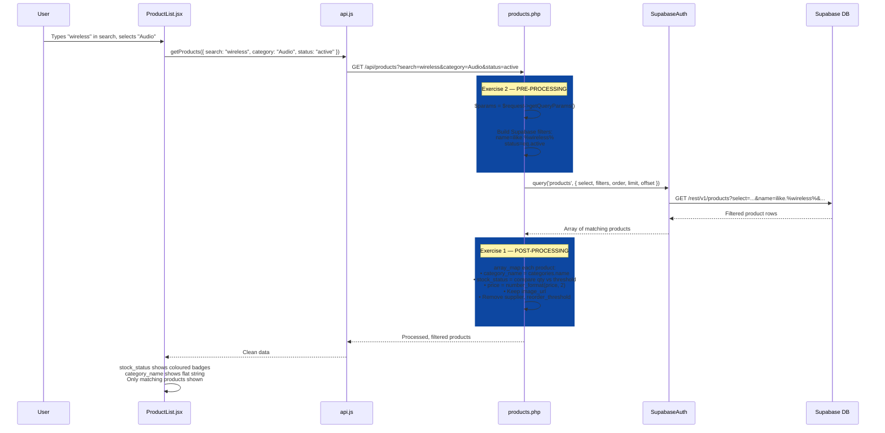
```mermaid
sequenceDiagram
    participant U as User
    participant PL as ProductList.jsx
    participant API as api.js
    participant PR as products.php
    participant SA as SupabaseAuth
    participant DB as Supabase DB

    U->>PL: Types "wireless" in search, selects "Audio"
    PL->>API: getProducts({ search: "wireless", category: "Audio", status: "active" })
    API->>PR: GET /api/products?search=wireless&category=Audio&status=active

    rect rgb(13, 71, 161)
        Note over PR,PR: Exercise 2 — PRE-PROCESSING
        PR->>PR: $params = $request->getQueryParams()
        PR->>PR: Build Supabase filters:<br/>name=ilike.%wireless%<br/>status=eq.active
    end

    PR->>SA: query('products', { select, filters, order, limit, offset })
    SA->>DB: GET /rest/v1/products?select=...&name=ilike.%wireless%&...
    DB-->>SA: Filtered product rows
    SA-->>PR: Array of matching products

    rect rgb(13, 71, 161)
        Note over PR,PR: Exercise 1 — POST-PROCESSING
        PR->>PR: array_map each product:<br/>• category_name = categories.name<br/>• stock_status = compare qty vs threshold<br/>• price = number_format(price, 2)<br/>• Keep image_url<br/>• Remove supplier, reorder_threshold
    end

    PR-->>API: Processed, filtered products
    API-->>PL: Clean data
    PL->>PL: stock_status shows coloured badges<br/>category_name shows flat string<br/>Only matching products shown
```

### 2.4 Exercise 3 — Date/Time Handling

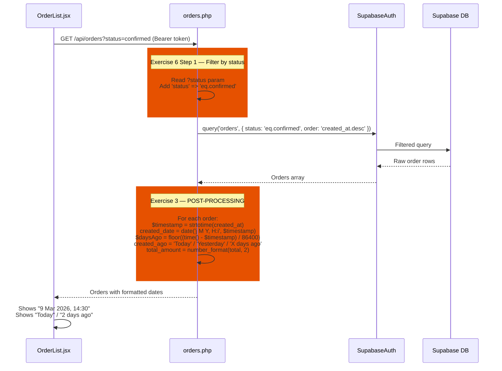
```mermaid
sequenceDiagram
    participant OL as OrderList.jsx
    participant OR as orders.php
    participant SA as SupabaseAuth
    participant DB as Supabase DB

    OL->>OR: GET /api/orders?status=confirmed (Bearer token)

    rect rgb(230, 81, 0)
        Note over OR,OR: Exercise 6 Step 1 — Filter by status
        OR->>OR: Read ?status param<br/>Add 'status' => 'eq.confirmed'
    end

    OR->>SA: query('orders', { status: 'eq.confirmed', order: 'created_at.desc' })
    SA->>DB: Filtered query
    DB-->>SA: Raw order rows
    SA-->>OR: Orders array

    rect rgb(230, 81, 0)
        Note over OR,OR: Exercise 3 — POST-PROCESSING
        OR->>OR: For each order:<br/>$timestamp = strtotime(created_at)<br/>created_date = date('j M Y, H:i', $timestamp)<br/>$daysAgo = floor((time() - $timestamp) / 86400)<br/>created_ago = 'Today' / 'Yesterday' / 'X days ago'<br/>total_amount = number_format(total, 2)
    end

    OR-->>OL: Orders with formatted dates
    OL->>OL: Shows "9 Mar 2026, 14:30"<br/>Shows "Today" / "2 days ago"
```

### 2.5 Exercise 4 & 5 — Product CRUD + Image Upload

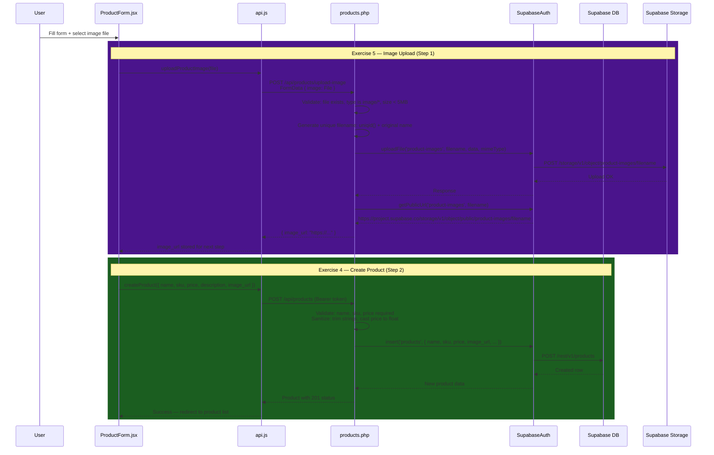
```mermaid
sequenceDiagram
    participant U as User
    participant PF as ProductForm.jsx
    participant API as api.js
    participant PR as products.php
    participant SA as SupabaseAuth
    participant DB as Supabase DB
    participant ST as Supabase Storage

    U->>PF: Fill form + select image file

    rect rgb(74, 20, 140)
        Note over PF,ST: Exercise 5 — Image Upload (Step 1)
        PF->>API: uploadProductImage(file)
        API->>PR: POST /api/products/upload-image<br/>FormData { image: File }
        PR->>PR: Validate: file exists, type is image/*, size < 5MB
        PR->>PR: Generate unique filename: uniqid() + original name
        PR->>SA: uploadFile('product-images', filename, data, mimeType)
        SA->>ST: POST /storage/v1/object/product-images/filename
        ST-->>SA: Upload OK
        SA-->>PR: Response
        PR->>SA: getPublicUrl('product-images', filename)
        SA-->>PR: https://project.supabase.co/storage/v1/object/public/product-images/filename
        PR-->>API: { image_url: "https://..." }
        API-->>PF: image_url stored for next step
    end

    rect rgb(27, 94, 32)
        Note over PF,DB: Exercise 4 — Create Product (Step 2)
        PF->>API: createProduct({ name, sku, price, description, image_url })
        API->>PR: POST /api/products (Bearer token)
        PR->>PR: Validate: name, sku, price required<br/>Sanitize: trim strings, cast price to float
        PR->>SA: insert('products', { name, sku, price, image_url, ... })
        SA->>DB: POST /rest/v1/products
        DB-->>SA: Created row
        SA-->>PR: New product data
        PR-->>API: Product with 201 status
        API-->>PF: Success — redirect to product list
    end
```

### 2.6 Exercise 6 — Order Creation (Most Complex)

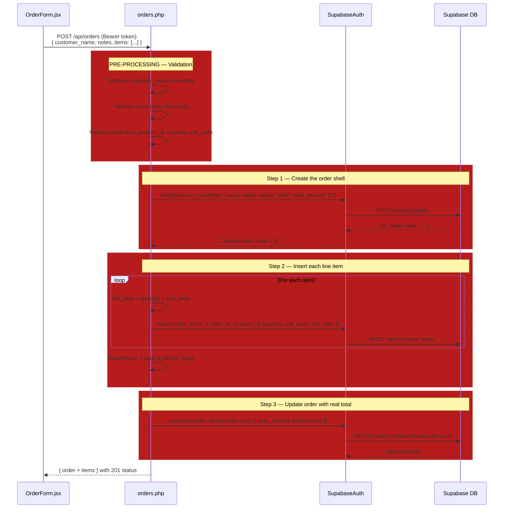
```mermaid
sequenceDiagram
    participant OF as OrderForm.jsx
    participant OR as orders.php
    participant SA as SupabaseAuth
    participant DB as Supabase DB

    OF->>OR: POST /api/orders (Bearer token)<br/>{ customer_name, notes, items: [...] }

    rect rgb(183, 28, 28)
        Note over OR,OR: PRE-PROCESSING — Validation
        OR->>OR: Validate customer_name not empty
        OR->>OR: Validate items array not empty
        OR->>OR: Validate each item: product_id, quantity, unit_price
    end

    rect rgb(183, 28, 28)
        Note over OR,DB: Step 1 — Create the order shell
        OR->>SA: insert('orders', { customer_name, notes, status: 'draft', total_amount: 0 })
        SA->>DB: POST /rest/v1/orders
        DB-->>SA: { id: "order-uuid", ... }
        SA-->>OR: Created order (total = 0)
    end

    rect rgb(183, 28, 28)
        Note over OR,DB: Step 2 — Insert each line item
        loop For each item
            OR->>OR: line_total = quantity × unit_price
            OR->>SA: insert('order_items', { order_id, product_id, quantity, unit_price, line_total })
            SA->>DB: POST /rest/v1/order_items
        end
        OR->>OR: totalAmount = sum of all line_totals
    end

    rect rgb(183, 28, 28)
        Note over OR,DB: Step 3 — Update order with real total
        OR->>SA: update('orders', 'id=eq.order-uuid', { total_amount: totalAmount })
        SA->>DB: PATCH /rest/v1/orders?id=eq.order-uuid
        DB-->>SA: Updated order
    end

    OR-->>OF: { order + items } with 201 status
```

### 2.7 Exercise 6 — Order Status State Machine

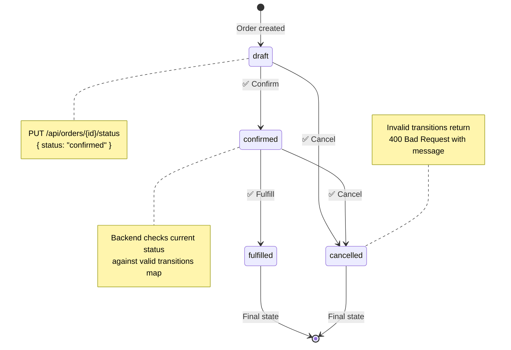
```mermaid
stateDiagram-v2
    [*] --> draft : Order created
    draft --> confirmed : ✅ Confirm
    draft --> cancelled : ✅ Cancel
    confirmed --> fulfilled : ✅ Fulfill
    confirmed --> cancelled : ✅ Cancel
    fulfilled --> [*] : Final state
    cancelled --> [*] : Final state

    note right of draft
        PUT /api/orders/{id}/status
        { status: "confirmed" }
    end note

    note right of confirmed
        Backend checks current status
        against valid transitions map
    end note

    note left of cancelled
        Invalid transitions return
        400 Bad Request with message
    end note
```

### 2.8 Exercise 7 — Dashboard Aggregation

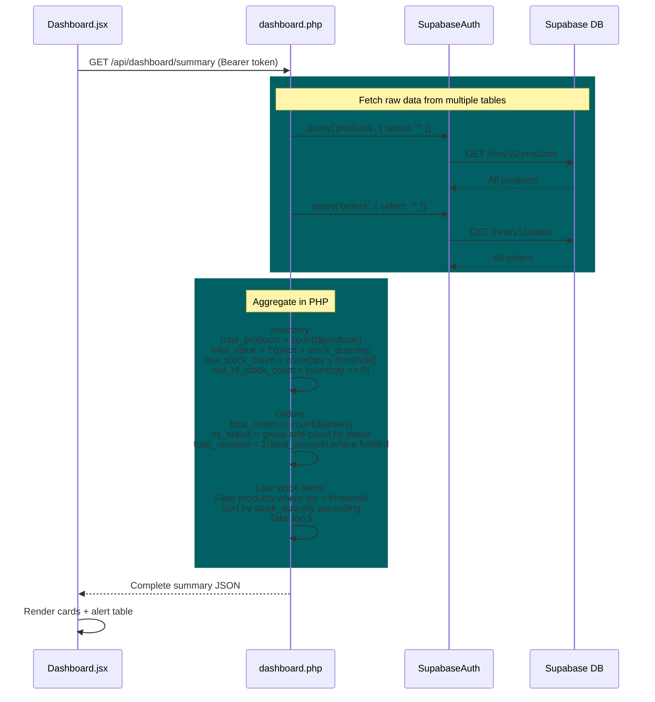
```mermaid
sequenceDiagram
    participant D as Dashboard.jsx
    participant DR as dashboard.php
    participant SA as SupabaseAuth
    participant DB as Supabase DB

    D->>DR: GET /api/dashboard/summary (Bearer token)

    rect rgb(0, 96, 100)
        Note over DR,DB: Fetch raw data from multiple tables
        DR->>SA: query('products', { select: '*' })
        SA->>DB: GET /rest/v1/products
        DB-->>SA: All products
        DR->>SA: query('orders', { select: '*' })
        SA->>DB: GET /rest/v1/orders
        DB-->>SA: All orders
    end

    rect rgb(0, 96, 100)
        Note over DR,DR: Aggregate in PHP
        DR->>DR: Inventory:<br/>total_products = count($products)<br/>total_value = Σ(price × stock_quantity)<br/>low_stock_count = count(qty ≤ threshold)<br/>out_of_stock_count = count(qty == 0)

        DR->>DR: Orders:<br/>total_orders = count($orders)<br/>by_status = group and count by status<br/>total_revenue = Σ(total_amount) where fulfilled

        DR->>DR: Low stock alerts:<br/>Filter products where qty ≤ threshold<br/>Sort by stock_quantity ascending<br/>Take top 5
    end

    DR-->>D: Complete summary JSON
    D->>D: Render cards + alert table
```

### 2.9 Exercise 8 — AI Integration

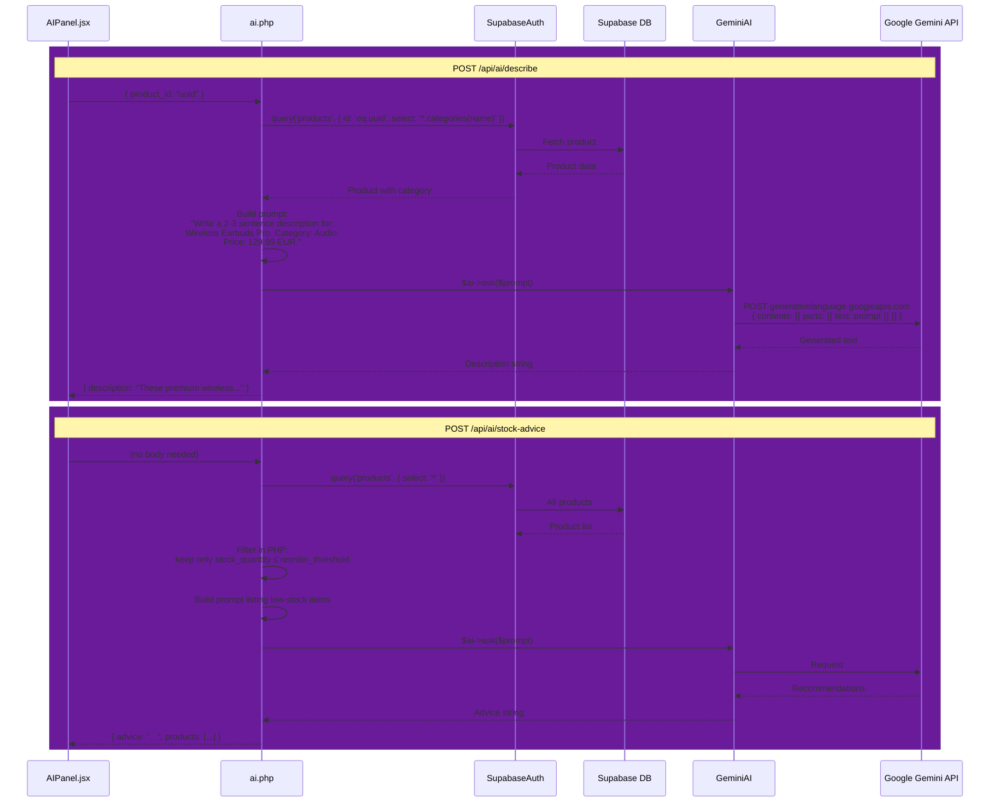
```mermaid
sequenceDiagram
    participant AI as AIPanel.jsx
    participant AIR as ai.php
    participant SA as SupabaseAuth
    participant DB as Supabase DB
    participant G as GeminiAI
    participant GEM as Google Gemini API

    rect rgb(106, 27, 154)
        Note over AI,GEM: POST /api/ai/describe
        AI->>AIR: { product_id: "uuid" }
        AIR->>SA: query('products', { id: 'eq.uuid', select: '*,categories(name)' })
        SA->>DB: Fetch product
        DB-->>SA: Product data
        SA-->>AIR: Product with category
        AIR->>AIR: Build prompt:<br/>"Write a 2-3 sentence description for:<br/>Wireless Earbuds Pro. Category: Audio.<br/>Price: 129.99 EUR."
        AIR->>G: $ai->ask($prompt)
        G->>GEM: POST generativelanguage.googleapis.com<br/>{ contents: [{ parts: [{ text: prompt }] }] }
        GEM-->>G: Generated text
        G-->>AIR: Description string
        AIR-->>AI: { description: "These premium wireless..." }
    end

    rect rgb(106, 27, 154)
        Note over AI,GEM: POST /api/ai/stock-advice
        AI->>AIR: (no body needed)
        AIR->>SA: query('products', { select: '*' })
        SA->>DB: All products
        DB-->>SA: Product list
        AIR->>AIR: Filter in PHP:<br/>keep only stock_quantity ≤ reorder_threshold
        AIR->>AIR: Build prompt listing low-stock items
        AIR->>G: $ai->ask($prompt)
        G->>GEM: Request
        GEM-->>G: Recommendations
        G-->>AIR: Advice string
        AIR-->>AI: { advice: "...", products: [...] }
    end
```

### 2.10 Complete Data Flow — All Exercises

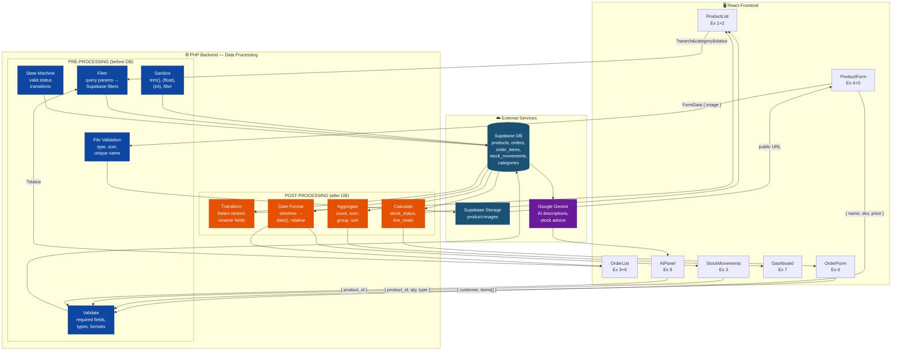
```mermaid
graph TB
    subgraph Frontend["🖥️ React Frontend"]
        direction LR
        PL["ProductList<br/>Ex 1+2"]
        PF["ProductForm<br/>Ex 4+5"]
        OL["OrderList<br/>Ex 3+6"]
        OF["OrderForm<br/>Ex 6"]
        SM["StockMovements<br/>Ex 3"]
        DASH["Dashboard<br/>Ex 7"]
        AIP["AIPanel<br/>Ex 8"]
    end

    subgraph Backend["⚙️ PHP Backend — Data Processing"]
        direction TB

        subgraph PreProcess["PRE-PROCESSING (before DB)"]
            V["Validate<br/>required fields,<br/>types, formats"]:::pre
            S["Sanitize<br/>trim(), (float),<br/>(int), filter"]:::pre
            F["Filter<br/>query params →<br/>Supabase filters"]:::pre
            FSM["State Machine<br/>valid status<br/>transitions"]:::pre
            FV["File Validation<br/>type, size,<br/>unique name"]:::pre
        end

        subgraph PostProcess["POST-PROCESSING (after DB)"]
            T["Transform<br/>flatten nested,<br/>rename fields"]:::post
            C["Calculate<br/>stock_status,<br/>line_totals"]:::post
            D["Date Format<br/>strtotime →<br/>date(), relative"]:::post
            A["Aggregate<br/>count, sum,<br/>group, sort"]:::post
        end
    end

    subgraph Services["☁️ External Services"]
        DB[("Supabase DB<br/>products, orders,<br/>order_items,<br/>stock_movements,<br/>categories")]:::external
        ST["Supabase Storage<br/>product-images"]:::external
        GM["Google Gemini<br/>AI descriptions,<br/>stock advice"]:::ai
    end

    PL -->|"?search&category&status"| F
    PF -->|"{ name, sku, price }"| V
    PF -->|"FormData { image }"| FV
    OL -->|"?status"| F
    OF -->|"{ customer, items[] }"| V
    SM -->|"{ product_id, qty, type }"| V
    AIP -->|"{ product_id }"| V

    V --> DB
    S --> DB
    F --> DB
    FSM --> DB
    FV --> ST

    DB --> T
    DB --> C
    DB --> D
    DB --> A
    DB --> GM

    T --> PL
    C --> PL
    C --> OF
    D --> OL
    D --> SM
    A --> DASH
    GM --> AIP
    ST -->|"public URL"| PF

    classDef pre fill:#0d47a1,stroke:#0a3680,color:#fff
    classDef post fill:#e65100,stroke:#bf4400,color:#fff
    classDef external fill:#1a5276,stroke:#154360,color:#fff
    classDef ai fill:#6a1b9a,stroke:#4a148c,color:#fff
```

---

## Part 3: Exercise Progression Map

### How exercises unlock each other

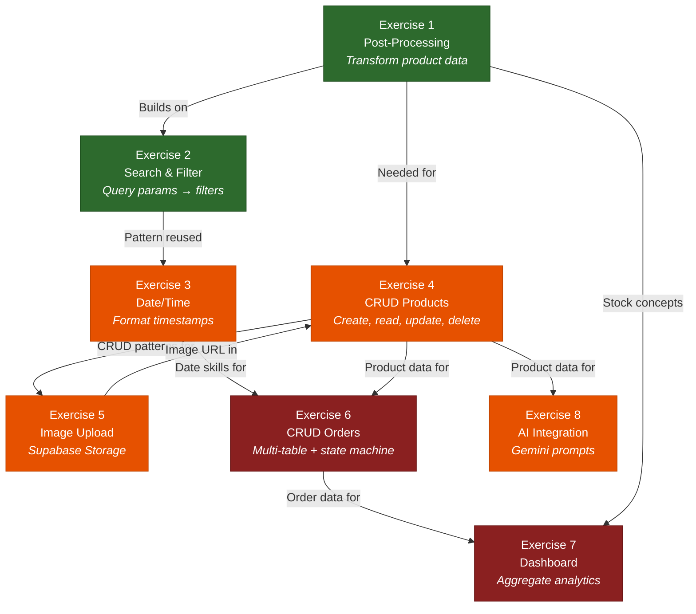
```mermaid
graph TD
    EX1["Exercise 1<br/>Post-Processing<br/><i>Transform product data</i>"]:::easy
    EX2["Exercise 2<br/>Search & Filter<br/><i>Query params → filters</i>"]:::easy
    EX3["Exercise 3<br/>Date/Time<br/><i>Format timestamps</i>"]:::medium
    EX4["Exercise 4<br/>CRUD Products<br/><i>Create, read, update, delete</i>"]:::medium
    EX5["Exercise 5<br/>Image Upload<br/><i>Supabase Storage</i>"]:::medium
    EX6["Exercise 6<br/>CRUD Orders<br/><i>Multi-table + state machine</i>"]:::hard
    EX7["Exercise 7<br/>Dashboard<br/><i>Aggregate analytics</i>"]:::hard
    EX8["Exercise 8<br/>AI Integration<br/><i>Gemini prompts</i>"]:::medium

    EX1 -->|"Builds on"| EX2
    EX1 -->|"Needed for"| EX4
    EX2 -->|"Pattern reused"| EX3
    EX3 -->|"Date skills for"| EX6
    EX4 -->|"CRUD patterns for"| EX5
    EX4 -->|"Product data for"| EX6
    EX4 -->|"Product data for"| EX8
    EX5 -->|"Image URL in"| EX4
    EX6 -->|"Order data for"| EX7
    EX1 -->|"Stock concepts"| EX7

    classDef easy fill:#2d6a2d,stroke:#1a4a1a,color:#fff
    classDef medium fill:#e65100,stroke:#bf4400,color:#fff
    classDef hard fill:#8a2020,stroke:#6b1515,color:#fff
```

### Exercise Legend

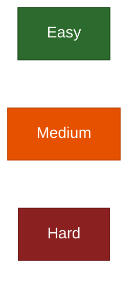
```mermaid
graph LR
    E["Easy"]:::easy
    M["Medium"]:::medium
    H["Hard"]:::hard

    classDef easy fill:#2d6a2d,stroke:#1a4a1a,color:#fff
    classDef medium fill:#e65100,stroke:#bf4400,color:#fff
    classDef hard fill:#8a2020,stroke:#6b1515,color:#fff
```

---

## Part 4: Database Relationships

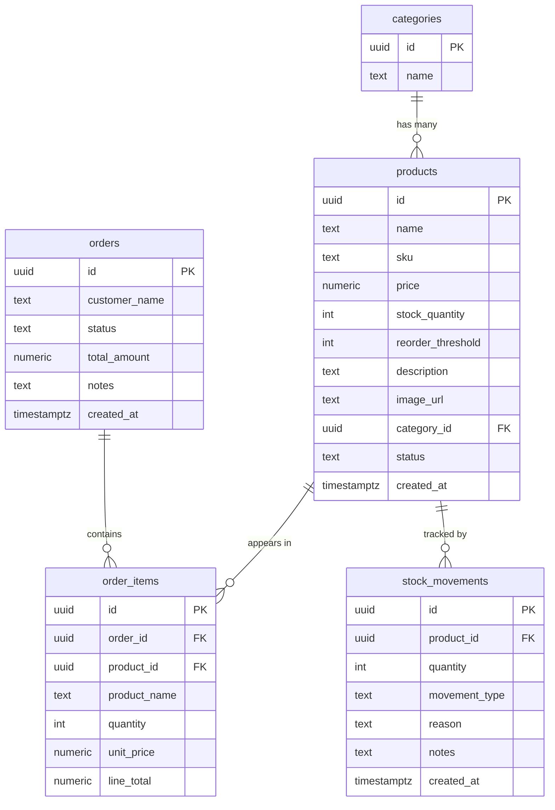
```mermaid
erDiagram
    categories ||--o{ products : "has many"
    products ||--o{ order_items : "appears in"
    products ||--o{ stock_movements : "tracked by"
    orders ||--o{ order_items : "contains"

    categories {
        uuid id PK
        text name
    }

    products {
        uuid id PK
        text name
        text sku
        numeric price
        int stock_quantity
        int reorder_threshold
        text description
        text image_url
        uuid category_id FK
        text status
        timestamptz created_at
    }

    orders {
        uuid id PK
        text customer_name
        text status
        numeric total_amount
        text notes
        timestamptz created_at
    }

    order_items {
        uuid id PK
        uuid order_id FK
        uuid product_id FK
        text product_name
        int quantity
        numeric unit_price
        numeric line_total
    }

    stock_movements {
        uuid id PK
        uuid product_id FK
        int quantity
        text movement_type
        text reason
        text notes
        timestamptz created_at
    }
```

---

## Part 5: Pre-Processing vs Post-Processing Summary

| Stage | What Happens | Exercises | PHP Functions |
|-------|-------------|-----------|---------------|
| **Pre-Processing** | Validate required fields | 4, 5, 6 | `empty()`, `isset()` |
| | Sanitize input | 4, 6 | `trim()`, `(float)`, `(int)` |
| | Read query params | 2, 3, 6 | `$request->getQueryParams()` |
| | Build Supabase filters | 2, 6 | String concatenation |
| | Validate file uploads | 5 | `getError()`, `getClientMediaType()`, `getSize()` |
| | Check state transitions | 6 | Array lookup |
| **Post-Processing** | Flatten nested objects | 1 | `$item['categories']['name']` |
| | Calculate derived fields | 1, 6 | `if/elseif`, arithmetic |
| | Format numbers | 1, 3, 7 | `number_format()` |
| | Format dates | 3 | `strtotime()`, `date()` |
| | Calculate relative time | 3 | `floor((time() - $ts) / 86400)` |
| | Aggregate data | 7 | `count()`, `array_filter()`, `array_sum()`, `array_map()` |
| | Build AI prompts | 8 | String interpolation |
